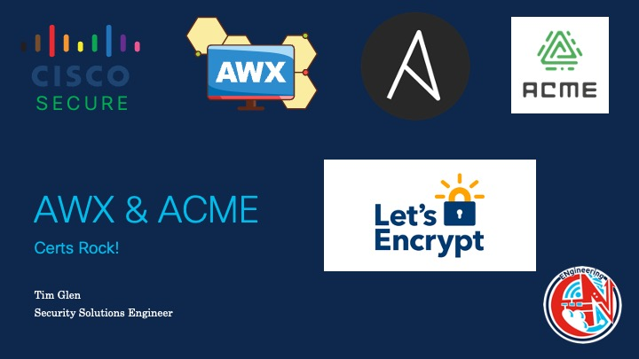

# awx-acme
 AWX ACME Playbooks

Obtaining Certificates from Let's Encrypt is easy. 

First Create a Private Key
/000-create-ec384-key.yaml

Next, Create a Let's Encrypt Account
/001-Create-Acme-Account-v2.yaml

Request a Certificate
/003-create-acme-certificate-v2.yaml

Done!
